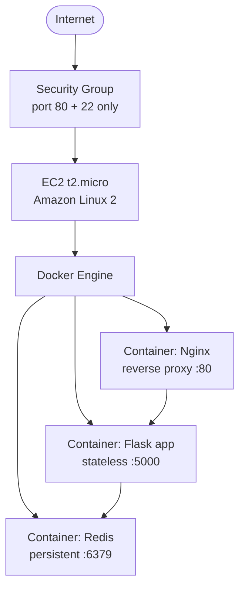

# URL Shortener — UAS Infrastruktur Awan

Tugas Besar UAS mata kuliah Infrastruktur Awan (BBK3CAB3), Telkom University.

Tujuan akademis: membuktikan secara empiris bahwa **kontainerisasi bersifat
komplementer terhadap virtualisasi (VM), bukan penggantinya**. Stack kontainer
(Flask + Redis + Nginx via Docker Compose) berjalan **di dalam** VM EC2 t2.micro —
merepresentasikan pola managed Kubernetes (kontainer di atas worker node VM).

## Struktur

```
project-uas-cloud/
├── app/
│   ├── app.py             ← Flask application
│   ├── Dockerfile         ← image app (python:3.13-alpine + uv + gunicorn)
│   └── pyproject.toml     ← flask, redis, gunicorn
├── nginx/
│   └── nginx.conf         ← konfigurasi reverse proxy
├── terraform/
│   ├── main.tf            ← EC2, VPC, security group, user_data
│   ├── variables.tf
│   └── outputs.tf         ← output IP publik EC2
├── docker-compose.yml
└── README.md
```



## Endpoint

| Method | Path | Keterangan |
|--------|------|------------|
| `POST` | `/shorten` | Body `{"url": "..."}` → buat kode 6-char, simpan ke Redis (TTL 14 hari), return **201** |
| `GET`  | `/<code>` | Redirect **301** ke URL asli (atau **404**) |
| `GET`  | `/info/<code>` | URL asli + sisa TTL (detik & hari) |
| `GET`  | `/` | Health check + status koneksi Redis |

## Menjalankan secara lokal

```bash
docker compose up -d        # build & jalankan 3 container
docker compose logs -f      # pantau log
docker compose ps           # cek status (hanya nginx yang map :80)
docker compose down         # hentikan
```

### Contoh penggunaan

```bash
# Buat short URL
curl -X POST http://localhost/shorten \
  -H "Content-Type: application/json" \
  -d '{"url": "https://google.com"}'
# -> {"code":"Ab3xZ9","short_url":"http://localhost/Ab3xZ9","url":"https://google.com"}

# Ikuti redirect
curl -L http://localhost/Ab3xZ9

# Lihat info + sisa TTL
curl http://localhost/info/Ab3xZ9
```

## Deploy ke AWS (Terraform) — otomatis, tanpa SSH

Alurnya: image `app` di-build di laptop & di-push ke Docker Hub; `terraform apply`
membuat EC2 yang **otomatis** menarik image + menjalankan stack via `user_data`
(tidak perlu `scp`/`ssh` manual).

Prasyarat: kredensial AWS (IAM user, bukan root) & EC2 key pair (untuk SSH darurat saja).

### 1. Build & push image app (di laptop)

```bash
docker login                                   # akun Docker Hub
docker build -t penicili/tubes-infra:v1 ./app  # samakan dengan image: di docker-compose.yml
docker push penicili/tubes-infra:v1
```

### 2. Provision + auto-deploy

```bash
cd terraform
terraform init
terraform apply        # pakai terraform.tfvars; ketik yes
# tunggu ~2-3 menit (user_data: install docker -> pull image -> up -d)
# buka http://<public_ip> dari output
```

`user_data` membaca `docker-compose.yml` + `nginx/nginx.conf` dari repo (via
Terraform `file()`), menanamnya ke `/opt/app` di instance, lalu menjalankan
`docker compose pull && up -d`. Log proses: `sudo cat /var/log/user-data.log`.

> Update image (mis. push `:v2` & ubah tag di `docker-compose.yml`): `terraform apply`
> akan **mengganti instance** otomatis (`user_data_replace_on_change = true`) sehingga
> redeploy tanpa SSH. Untuk update cepat tanpa replace, boleh SSH lalu `docker compose pull && up -d`.

> ⚠️ **Wajib `terraform destroy` setelah demo selesai** (free tier safety).
> ```bash
> terraform destroy
> ```

## Skenario uji (Bab V)

1. `POST /shorten` → cek response **201** + `code`.
2. `GET /<code>` → cek redirect **301** (`curl -I`).
3. `GET /info/<code>` → cek `ttl_seconds` berkurang seiring waktu.
4. `docker compose restart redis` → ulangi `GET /info/<code>`, **data tetap ada**
   (named volume `redis-data` + AOF `appendonly`).
5. `docker stats` → catat RAM + CPU per container (target total < 600 MB).
6. Akses Redis port 6379 dari luar VM → **harus gagal** (Security Group hanya buka 80 & 22,
   dan Redis tidak expose port ke host).

## Catatan keamanan

- Hanya port **80** dan **22** dibuka di Security Group AWS.
- Flask (5000) dan Redis (6379) hanya accessible via Docker bridge network — tidak
  di-expose ke host maupun internet.
- Tidak ada credential hardcoded; Redis tanpa auth (internal network only).
- Terraform memakai IAM user least-privilege, bukan root account.
